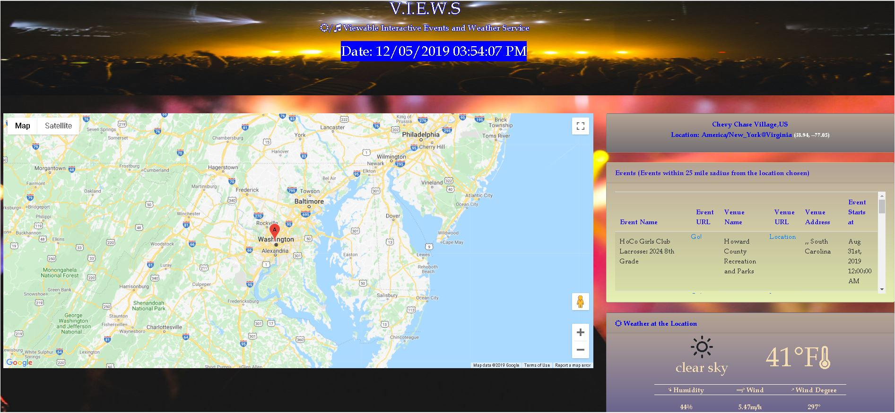

# V.I.E.W.S
Viewable Interactive Events and Weather Service
Version 1.0
Original Deployment Date: 12.5.2019

### The Idea:
Create an app that allowed the user to click on a map location to get upcoming events and weather for said location.

### User Guide:
1. Click on desired location on VIEW map.
2. View events at selected location.
3. View weather at selected location.

### Built Utilizing:
- Google Maps API [Google Maps Javascript API](https://developers.google.com/maps/documentation/javascript/tutorial)
- Eventful API [Eventful API](https://api.eventful.com/docs)
- OpenWeather API [OpenWeather API](https://openweathermap.org/api)
- Font Awesome Icons [Font Awesome Icons](https://fontawesome.com/)
- Bootstrap CSS
- Moment js

### Original Contributors:
- Kiran Kesari
- Eric Pinder
- Zachariah Thomas
- Brigid Woolery

### VIEWS in Development:
User Stories:
	1. As a user, I would like an interactive map that allows me to choose a location.
		- Acceptance Criteria: jQuery function to capture user click and return location from Google Maps.
 
	2. As a user, I would like an interactive map that allows me to choose a location.
		- Acceptance Criteria: jQuery function to capture user click and return location.
 
	3. As a user, I want to be able to view the events of a select location.
		- Acceptance Criteria: Register for Eventful API.
 
	4. As a user, I want to be able to view the weather of a select location.
		- Acceptance Criteria: Register for Weather API.
 
	5. As a user, I was to be able to click on a location to find event and weather information.
		- Acceptance Criteria: Register for Google Maps API.
 

### Wireframe:
 

### Future Development:
- Login Page
- Calendar
- Abitlity to mark favorites
- Search by event name or artist/date
- Navigation / Directions to the selected event
